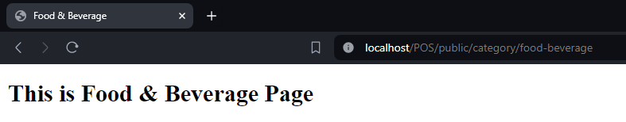

### Doni Wahyu Kurniawan <br> TI-2H | 13 | 2241720015

### <center>Tugas Jobsheet 2 - POS</center>
### Home Page
Views
```html
<!DOCTYPE html>
<html lang="en">
<head>
    <meta charset="UTF-8">
    <meta name="viewport" content="width=device-width, initial-scale=1.0">
    <meta http-equiv="X-UA-Compatible" content="ie=edge">
    <title>Home</title>
</head>
<body>
    <h1>This is Home Page</h1>
</body>
</html>
```
Controller
```php
<?php

namespace App\Http\Controllers;

use Illuminate\Http\Request;

class HomeController extends Controller
{
    public function home()
    {
        return view('home');
    }
}
```
Route
```php
Route::get('/', [HomeController::class, 'home']);
```
Home Page\

### Product Page
Views
* Food Bevarage
  ```html
  <!DOCTYPE html>
  <html lang="en">
  <head>
      <meta charset="UTF-8">
      <meta name="viewport" content="width=device-width, initial-scale=1.0">
      <meta http-equiv="X-UA-Compatible" content="ie=edge">
      <title>Food & Beverage</title>
  </head>
  <body>
      <h1>This is Food & Beverage Page</h1>
  </body>
  </html>
  ```
* Beauty Health
  ```html
  <!DOCTYPE html>
  <html lang="en">
  <head>
      <meta charset="UTF-8">
      <meta name="viewport" content="width=device-width, initial-scale=1.0">
      <meta http-equiv="X-UA-Compatible" content="ie=edge">
      <title>Beauty Health</title>
  </head>
  <body>
      <h1>This is Beauty Health Page</h1>
  </body>
  </html>
  ```
* Home Care
  ```html
  <!DOCTYPE html>
  <html lang="en">
  <head>
      <meta charset="UTF-8">
      <meta name="viewport" content="width=device-width, initial-scale=1.0">
      <meta http-equiv="X-UA-Compatible" content="ie=edge">
      <title>Home Care</title>
  </head>
  <body>
      <h1>This is Home Care Page</h1>
  </body>
  </html>
  ```
* Baby Kid
  ```html
  <!DOCTYPE html>
  <html lang="en">
  <head>
      <meta charset="UTF-8">
      <meta name="viewport" content="width=device-width, initial-scale=1.0">
      <meta http-equiv="X-UA-Compatible" content="ie=edge">
      <title>Baby Kid</title>
  </head>
  <body>
      <h1>This is Baby Kid Page</h1>
  </body>
  </html>
  ```
Controller
```php
<?php

namespace App\Http\Controllers;

use Illuminate\Http\Request;

class CategoryController extends Controller
{
    public function show($category)
    {
        $categories = ['baby-kid', 'beauty-health', 'food-beverage', 'home-care'];

        if (in_array($category, $categories)) {
            return view($category);
        } else {
            abort(404);        
        }
    }
}
```
Route
```php
Route::prefix('category')->group(function () {
    Route::get('/{category}', [CategoryController::class, 'show'])->name('categories.show');
});
```
* Food Beverage Page\

* Beauty Health Page\

* Home Care Page\

* Baby Kid Page\

### User Page
Views
```html
<!DOCTYPE html>
<html lang="en">
<head>
    <meta charset="UTF-8">
    <meta name="viewport" content="width=device-width, initial-scale=1.0">
    <meta http-equiv="X-UA-Compatible" content="ie=edge">
    <title>User Profile</title>
</head>
<body>
    <h1>User Profile</h1>
    <p>ID: {{ $user->id }}</p>
    <p>Name: {{ $user->name }}</p>
</body>
</html>
```
Controller
```php
<?php

namespace App\Http\Controllers;

use Illuminate\Http\Request;

class UserController extends Controller
{
    public function user($id, $name)
    {
        return view('user')
        ->with('id', $id)
        ->with('name', $name);
    }
}
```
Route
```php
Route::get('user/{id}/name/{name}', [UserController::class, 'user']);
```
User Page\

### Sales Page
View
```html
<!DOCTYPE html>
<html lang="en">
<head>
    <meta charset="UTF-8">
    <meta name="viewport" content="width=device-width, initial-scale=1.0">
    <meta http-equiv="X-UA-Compatible" content="ie=edge">
    <title>Sales</title>
</head>
<body>
    <h1>This is Sales Page</h1>
</body>
</html>
```
Controller
```php
<?php

namespace App\Http\Controllers;

use Illuminate\Http\Request;

class SalesController extends Controller
{
    public function sales()
    {
        return view('sales');
    }
}
```
Route
```php
Route::get('/sales', [SalesController::class, 'sales']);
```
Sales Page\
